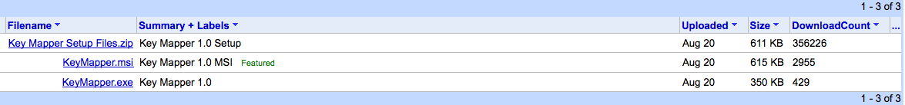

# Key Mapper

## Make your keyboard work the way you want it to

### Features

Key Mapper uses a virtual keyboard to create and show mappings. It will change the keyboard to reflect whatever keyboard you have active. You can browse the keyboards installed on your PC if you like.

As a convenience for people who have disabled the Caps Lock, Num Lock or Scroll Lock keys, Key Mapper has a facility to toggle the value of these keys, in case - for example - an application sets Caps Lock on but the key is disabled.

* * *

[Download .exe file (Windows 10/11 or .Net 4.8)](https://github.com/stuartd/keymapper/releases/download/keymapper/KeyMapper.exe)

You will need to have Administrative access to your computer.

### **If you're using a really old version of KeyMapper in modern versions of Windows (i.e. 7 or later), you will have to initially switch to 'Boot' mappings from the Mappings menu.**

#### **If you don't do this, your mappings won't work. If you don't see this menu item or it's empty, then you don't have to do anything!**

This is because both Windows XP and Vista supported per-user key mappings written to `HKEY_CURRENT_USER\Keyboard Layout` and when KeyMapper was released, those were the latest versions.

Then Windows 7 came along and dropped the unofficial or accidental support, and it doesn't look like it's coming back.

If you're interested, my original blog post from 2008 on per-user scancode mappings is reproduced below.

I did the work required to port it in 2012 and that's what the current master branch represents.

Support: [mailto:keymappersupport@gmail.com](mailto:keymappersupport@gmail.com)

### Per-User Scancode Mappings [From 2008, Windows 7 was released in 2009]

One thing that distinguishes [the old version of!] Key Mapper from other scancode mapping programs is that it lets you map or disable keys on a per-user basis: when Microsoft [originally implemented scancode mappings in Windows 2000](http://www.microsoft.com/whdc/archive/w2kscan-map.mspx), they stated in the "disadvantages" section:

> The mappings stored in the registry work at system level and apply to all users. These mappings cannot be set to work differently depending on the current user.

This is because the mappings are stored in `HKEY_LOCAL_MACHINE\SYSTEM\CurrentControlSet\Control\Keyboard Layout` which needs Administrative access to change and is only loaded at boot time.

In Windows XP, though, per-user mappings were quietly introduced, with no fanfare or documentation: scancode mappings set in the `HKEY_CURRENT_USER\Keyboard Layout` key were recognised, and applied to an individual user profile. This meant that mappings can be added or removed by logging off and logging back on again - still inconvenient, but less so than a full reboot: it also meant that mappings can be set up users without Administrative rights (and mappings set in `HKEY_LOCAL_MACHINE` were overridden by those in `HKEY_CURRENT_USER`).

It''s possible that Microsoft kept this quiet because user mappings are incompatible with Fast User Switching: when you switch to an account that''s already logged on, the mappings are not reloaded. It''s also possible that because they kept it quiet, the Fast User Switching development team didn''t realise that user mappings should be reloaded when switching users.

While this was a possible disadvantage to using user mappings, most people probably don''t use more than one account on their computer anyway, and in computers attached to a domain (i.e. corporate PCs) which may often be used by different people Fast User Switching isn%27t available anyway.

There are some other advantages to user mappings:

*   They don''t require Administrative rights to be set or removed.
*   Different users can have different mappings - one can have Caps Lock disabled but Num Lock enabled, another can have them the other way round
*   Keys can be mapped on shared computers without affecting all users

Originally developed at http://code.google.com/p/keymapper where it was popular with the shareware sites of the time

### Trivia
There is [was?] yet another place scancode mappings can be set - in the `HKEY_USERS\.DEFAULT\Keyboard Layout` key. These apply at the login prompt, but are then removed when logged in.
