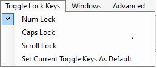
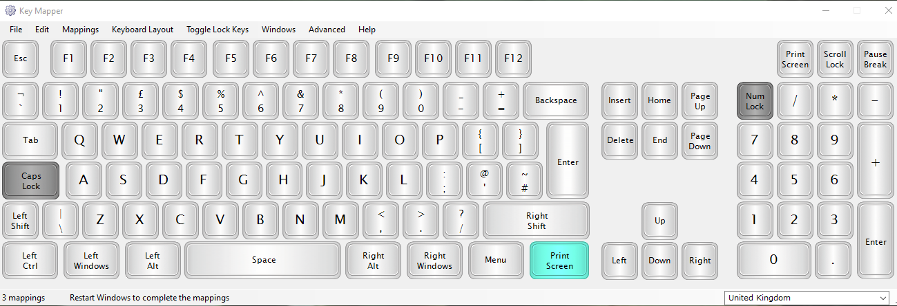
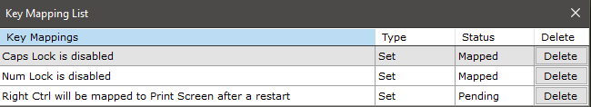
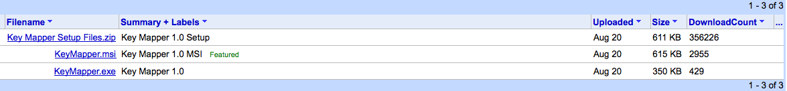

# Key Mapper

## Makes your keyboard work the way **you** want it to

### Features

Key Mapper uses a virtual keyboard using your current keyboard layout to create and display key mappings: a key can be mapped to another key or disabled altogether.

## Why would I do this?

Perhaps you don't ever want caps lock on or num lock off, so you can disable those keys (while still being able to set the values in the Toggle menu!)

Or perhaps one of your physical keys doesn't work, in which case you can use another key to stand in for it.

### How do I install KeyMapper?

[Download the current release .exe file (requires Windows 10/11 or .Net 4.8)](https://github.com/stuartd/keymapper/releases/download/1.4/KeyMapper.exe)

**You will need to have Administrative access to your computer.**

* * *

### Help! I have a problem!

Support: [mailto:keymappersupport@gmail.com](mailto:keymappersupport@gmail.com)

* * *

### UI

* * *

### History

I created KeyMapper in 2007 when my employer decided to replace the in-house financial accounting systems we had built with off-the-shelf systems, but retained us for support only, so I had time on my hands. 

My intention was to really get to grips with the (then) new language C# and also to solve a problem I had - **I never wanted caps lock on or num lock off!** - using scancode mappings: I ended up taking a deep dive into keyboard layouts, localization, internationalization, and distributed source control, as well as C#, the Win32API and Windows Forms.

The documentation for scancode mappings stated:

> The mappings stored in the registry work at system level and apply to all users. **These mappings cannot be set to work differently depending on the current user.**

But I discovered that Windows XP (and later Vista) supported per-user key mappings written to `HKEY_CURRENT_USER\Keyboard Layout` and when KeyMapper was written, XP was the latest Windows version.

Because this was never documented, it was an opportunity to build something that would be of real utility - let people set keyboard mappings for their own user account, which no other programs at the time seemed to support, using a GUI and drag-and-drop.

But then Windows 7 came along and [dropped the unofficial support](https://web.archive.org/web/20150306040530/http://justkeepswimming.net/keymapper/blog/default.aspx?p=7) for per-user scancode mappings, and it doesn't look like it's ever coming back: I took out all the code that used user mappings and fixed the UI, but other than that the code is essentially as it was in 2008: needless to say this is not at all how I would write it now..

If you're interested, my original blog post from 2008 on per-user scancode mappings is reproduced [below](#per-user-scancode) (the blog itself is available [on the Internet Archive](https://web.archive.org/web/20150306040530/http://justkeepswimming.net/keymapper/blog/default.aspx)).

Another blog article that may be of interest: the strange quirks of remapping [The Pause and Num Lock keys](https://web.archive.org/web/20140530115024/http://justkeepswimming.net/keymapper/blog/default.aspx?p=2), where (at least at the time of writing) the Pause key could be coerced into activating keyboard command which normally require two keys, for example `Windows-L`

* * *  

## Documentation

I have hosted the (extremely detailed!) Scan Code Specification (Revision 1.3a — March 16, 2000) [here](scancode.doc) - it's commonly available as a PDF but this is the original `.doc` file.

There is also a comprehensive reference on scancode remapping in the [Keyboard ScanCodes For Remapping](https://github.com/Lamer87/Keyboard_ScanCodes_for_remapping?utm_source=chatgpt.com) repo.

* * * 

### Credits

The image used for the keyboard keys is based on the blank icon in the keyboard icon set released by Alan Who?, used with permission.

The late Michael Kaplan's [blog](https://web.archive.org/web/20250000000000*/%20http://blogs.msdn.com/b/michkap) was invaluable in understanding the minutiae of how Windows actually handles internationalization, localization, collations and keyboard usage

* * *

### Per-User Scancode Mappings [From 2007, Windows 7 was released in 2009]

One thing that distinguishes Key Mapper from other scancode mapping programs is that it lets you map or disable keys on a per-user basis: when Microsoft [originally implemented scancode mappings in Windows 2000](https://web.archive.org/web/20090208232046/https://www.microsoft.com/whdc/archive/w2kscan-map.mspx), they stated in the "disadvantages" section:

> The mappings stored in the registry work at system level and apply to all users. **These mappings cannot be set to work differently depending on the current user.** [emphasis added]

This is because the mappings are stored in `HKEY_LOCAL_MACHINE\SYSTEM\CurrentControlSet\Control\Keyboard Layout` which needs Administrative access to change and is only loaded at boot time.

In Windows XP, though, per-user mappings were quietly introduced, with no fanfare or documentation: scancode mappings set in the `HKEY_CURRENT_USER\Keyboard Layout` key were recognised, and applied to an individual user profile.

This meant that mappings can be added or removed by logging off and logging back on again - still inconvenient, but less so than a full reboot: it also meant that mappings can be set up by users without Administrative rights (and mappings set in `HKEY_LOCAL_MACHINE` were overridden by those in `HKEY_CURRENT_USER`).

It's possible that Microsoft kept this quiet because user mappings are incompatible with Fast User Switching: when you switch to an account that's already logged on, the mappings are not reloaded.

It's also possible that because they kept it quiet, the Fast User Switching development team didn't realise that user mappings should be reloaded when switching users.

While this was a disadvantage to using user mappings, most people probably don't use more than one account on their computer anyway, and in computers attached to a domain (i.e. corporate PCs) which may often be used by different people Fast User Switching isn't available anyway.

There are some clear other advantages in user mappings:

*   They don't require Administrative rights to be set or removed.
*   Different users can have different mappings - one can have Caps Lock disabled but Num Lock enabled, another can have them the other way round
*   Keys can be mapped on shared computers without affecting all users

*** 

### Origin

Originally developed [on `code.google.com`](https://code.google.com/archive/redirect/a/code.google.com/p/keymapper?movedTo=https:%2F%2Fgithub.com%2Fstuartd%2Fkeymapper
) [^1] where it was popular with the shareware sites of the time

* * *

### Trivia
- There was (is?) another place scancode mappings could be set - in the `HKEY_USERS\.DEFAULT\Keyboard Layout` key. These apply at the login prompt, but are then removed when logged in.

- You can browse the keyboards installed on your PC if you wish or view a 'slideshow' of all currently installed keyboards - that's in the 'Advanced' menu.

[^1]: The link of course redirects back to this repo
